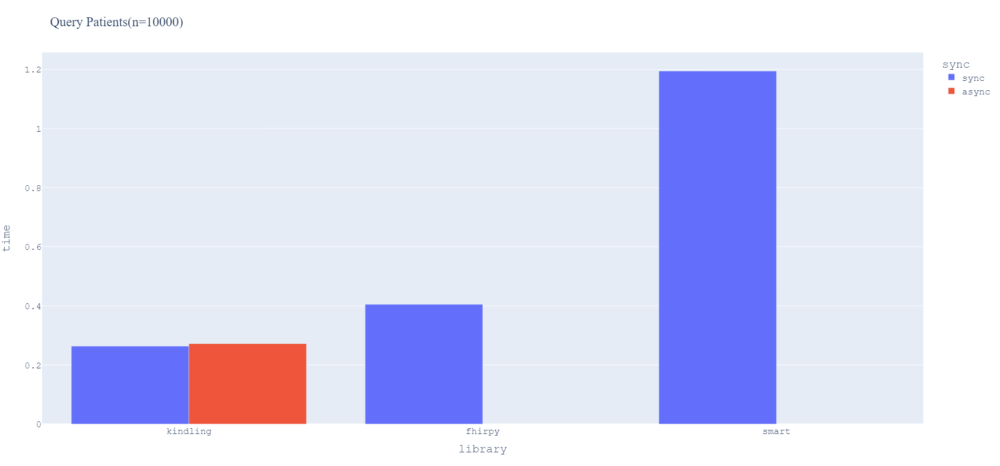

# Benchmarks

## Server Benchmarks
A preconfigured setup of common FHIR Servers is provided in the `docker-compose.yml` file. The compose file includes a Blaze, HAPI, and Linux4Health FHIR server.


### Starting the servers

Start the servers in the `benchmarks` directory (`cd benchmarks`) with docker compose
```bash	
docker compose up -d
```

### Running the benchmarks

If not already installed, install the `fhir_kindling` with the ds extras
```bash
pip install fhir_kindling[ds] --pre
```

These servers are configured by default in the `benchmark_servers.py` script. If you want to add your own server, you can do so by adding it to the `servers` list in the script.

Run the benchmark script
```bash
python benchmark_servers.py
```


### Configuring the script

Modify the dataset size and the number of attempts made for each step in the benchmark by settings the `dataset_size` and `n_attempts` variables on the `ServerBenchmark` instance. (Keep in mind that the dataset size changes with approximately a factor of 10 based on the parameter given in the `dataset_size` variable.)


## Client Benchmarks
Comparing the library's performance with the other most popular client libraries `fhirpy` and `fhirclient`.
Perform the benchmarks by running `python benchmarks/benchmark_clients.py`

### Environment

All operations were performed against a [Blaze](https://github.com/samply/blaze) server version `0.17.12` running in a
docker container on a 64-bit Windows 11 machine.

### Query Benchmark

When querying `n=10000` patients from the server the following results were observed. FHIR kindling executed the sync
query at least twice as fast as the other client libraries. Comparisons for the async versions will follow.



